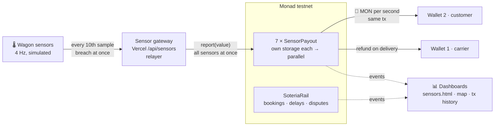

<div align="center">

# 🚆 Soteria · Paid per Second

### Too hot? Get paid. Every second.

**Freight sensors that settle their own claims on Monad.**
A wagon's cargo leaves its limits → the contract pays the customer in MON, **in the same transaction as the reading**.

[**▶ Live demo**](https://soteria-monad.vercel.app/sensors.html) · [Dashboard](https://soteria-monad.vercel.app) · [A real payment on the explorer](https://testnet.monadvision.com/tx/0x49103714c29da0a701ac80226bddd2f21736757810b08efbee50b215c1df5569) · [Contract](https://testnet.monadvision.com/address/0x125a0db0c0ec3bd47abb8d82c53e4bc312406d28)

`Monad testnet` · `Solidity` · `Foundry` · `viem` · `React/Vite` · `Mapbox` · `Vercel`

Built at **Monad Blitz Berlin**, 26 Sep 2026

</div>

---

## From darknet to daylight

Blockchain got famous on the darknet: pay, and prove nothing. **We flip it.**

| 2011 | 2026 · this repo |
|---|---|
| Anonymous payments, nobody can prove who did what | Named parties: carrier, customer, sensor gateway |
| "Blockchain" = dubious | Every reading and every payment public and permanent |
| Rules bent by whoever holds the data | Rules fixed in code before the trip; nobody can change a reading afterwards |

The customer, the insurer and a court all read **the same record**. The next step is insurance that pays on proof, and carriers whose clean runs become a track record they own.

## The rule in 30 seconds

1. 🔒 **Bond in the contract.** The carrier funds it; terms come from the case data.
2. 🔥 **A reading past the limit** starts an excursion, timed by the block clock.
3. ⏳ **Grace period** (10 s for reefers): nothing is paid.
4. 💸 **Every reading after that pays `seconds × rate`** in MON to the customer, in that transaction, up to the cap.
5. ❄️ **Back in limits:** payments stop. On delivery, the rest of the bond goes back to the carrier.

| Cargo | Limit | Grace | Rate | Cap |
|---|---|---|---|---|
| Frozen food | above −15 °C | 10 s | €20/s | €6,000 |
| Pharmaceuticals | above 8 °C | 10 s | €400/s | €12,000 |
| Hazardous liquid | pressure below 3.8 bar / shock above 2 g | none | lump sum | €9,000 |

Demo scale: **1 MON = €100,000**, so the pharma rate is 0.004 MON/s.



## Why Monad

| | Measured today | Why it matters |
|---|---|---|
| ⚡ **0.3 s blocks** | 60 blocks in 18 s during a pharma excursion | A per-second payment needs a chain that settles faster than the clock ticks |
| 🔀 **Parallel execution** | 7 sensors send at the same moment, each contract has its own storage | Thousands of wagons don't queue behind each other |
| 🧱 **150M gas per block** | measured on testnet | Room for a whole fleet's readings |
| 🛠️ **Plain EVM** | Solidity, Foundry and viem unchanged | Nothing new to learn; any EVM team can integrate |

> Other chains can record that the cargo got warm. **Monad pays for it while it is still warm.**

## Proof: every row is a real testnet transaction

The pharma wagon `s3/W02`, 26 Sep 2026, 13:52 UTC:

| t | Reading | What the contract did | Paid to the customer |
|---|---|---|---|
| +0 s | 8.8 °C | excursion starts, grace 10 s | – |
| +2 … +10 s | 9.0 → 9.8 °C | grace: nothing paid | – |
| +13 s | 10.0 °C | pays 3 s × 0.004 | [0.012 MON](https://testnet.monadvision.com/tx/0x84d66446c05591d8d639ddb48274d8231c682f511df736bb8c5e98d5a4f43613) |
| +14 s | 10.2 °C | pays 1 s | [0.004 MON](https://testnet.monadvision.com/tx/0x31fef9d675798a0ad4d31e9dc1805a711d749a8814b9413b7b5889fa8d84051b) |
| +16 s | 10.4 °C | pays 2 s | [0.008 MON](https://testnet.monadvision.com/tx/0x12d03a83c5f517a4f71caeb500e4728f050a69db3fa8286c875c343518c1df36) |
| +18 s | 5.4 °C | pays 2 s, then **back in limits: excursion ends** | [0.008 MON](https://testnet.monadvision.com/tx/0xa74fd1a7af99e75e6597f2b800f90b92cf24c369a59e408f9c00b2e4b7e300a3) |

Across the day's runs: **127+ transactions, 0 failed**, customer wallet [`0x610C…C020`](https://testnet.monadvision.com/address/0x610C0DD8eA0f80e29d942a5977BAf6429E6BC020) paid in native MON. You can see it in any wallet, with no token import. The full history is in [`sensor-demo/data/tx-dashboard.html`](sensor-demo/data/tx-dashboard.html).

On [the live page](https://soteria-monad.vercel.app/sensors.html) every payment pops up as a card. Click it to open the transaction on the explorer.

## What's in the box

| | What it does | Where |
|---|---|---|
| **SensorPayout** | One contract per wagon condition, deployed as EIP-1167 copies; grace, per-second MON payments, cap, refund | [`contracts/src/SensorPayout.sol`](contracts/src/SensorPayout.sol) · [`sensor-demo/`](sensor-demo/) · [`/sensors.html`](https://soteria-monad.vercel.app/sensors.html) |
| **SoteriaRail** | Full rail logistics: bookings, carrier bond, cold-chain accrual, hazmat alerts, delays with a challenge window, two-signature settlements | [`contracts/src/SoteriaRail.sol`](contracts/src/SoteriaRail.sol) · [`relayer/`](relayer/) · [dashboard](https://soteria-monad.vercel.app) |
| **Dashboards** | 3D map, fleet sensors, transactions log, payment pop-ups, tx history | [`soteria-frontend/`](soteria-frontend/) |

**32 Foundry tests** (22 SoteriaRail + 10 SensorPayout).

### What is real, what is simulated

| | |
|---|---|
| ✅ **Real** | Transactions, contract logic, MON payments on Monad testnet |
| 🧪 **Simulated** | Sensor values (a 4 Hz stream in code; every 10th sample on chain, a breach at once) |
| 📏 **Demo scale** | Amounts: 1 MON = €100,000; timings compressed (grace 10 s) |

## Quickstart

```shell
# Public: nothing to install
open https://soteria-monad.vercel.app/sensors.html        # press "Overheat · pharma"

# Contracts
cd contracts && forge install foundry-rs/forge-std --no-git && forge test   # 32 tests

# Sensor contracts on testnet (needs sensor-demo/.env: NETWORK=testnet, SENSOR_GATEWAY_KEY, WALLET_1, WALLET_2)
cd sensor-demo && npm i && npm run deploy && npm run demo

# Whole demo on this machine against testnet (relayer :8787 + dashboard :5173)
./demo-local.sh
```

Deployed on Monad testnet:
- **SensorPayoutFactory:** [`0x125a0db0c0ec3bd47abb8d82c53e4bc312406d28`](https://testnet.monadvision.com/address/0x125a0db0c0ec3bd47abb8d82c53e4bc312406d28)
- **SoteriaRail:** [`0x01ca38e6540091d95f68d944430aafbd827654d2`](https://testnet.monadvision.com/address/0x01ca38e6540091d95f68d944430aafbd827654d2)
- **TEUR:** [`0x097b2ec554028c91f207570c7d6dab8b70747275`](https://testnet.monadvision.com/address/0x097b2ec554028c91f207570c7d6dab8b70747275)

---

# SoteriaRail: the full rail system

Real-time monitoring of freight trains with automatic compensation. Wagons with
sensitive cargo report their sensors to Monad. When the cold chain breaks or a train
runs late, the contract compensates the cargo owner within a second, without a claim
form or a dispute. Nobody triggers the payment, and nobody can stop it.

**Before:** damage → report → assessment → dispute → paid after months.
**Now:** the sensor reading is the claim, and the block that records it settles it.

## Why a blockchain, why Monad

- **Neutral record.** Today the carrier, which is the liable party, holds the sensor
  data. On chain, no party can change a reading afterwards.
- **Self-executing, pre-funded.** The payout rule is agreed at booking, and the
  carrier's bond sits in the contract.
- **Monad makes it practical:**
  - Payouts are final in 0.6 s on L1.
  - Each wagon writes only its own storage slot, so a whole corridor switching to
    1 Hz at once executes in parallel without conflicts.
  - A reading costs ~0.006 MON.
  - It is plain Solidity.
  - The dashboard reads the contract's events straight from the node (`monadLogs`,
    Proposed → Finalized), with no indexer.

| | Final after | Bursts | EVM |
|---|---|---|---|
| Ethereum | ~13 min | ~15–30 TPS network-wide | ✅ |
| L2 (Base, Arbitrum) | Final only once Ethereum settles | good | ✅ |
| Solana | seconds | very good | ❌ |
| **Monad** | **0.6 s** | **~10k TPS, parallel** | ✅ |

## Sensors only where needed

| Cargo | Sensor | On chain |
|---|---|---|
| frozen food, pharmaceuticals (reefer) | temperature | automatic compensation per second out of range |
| hazardous liquid (tank) | pressure, temperature, shock | timestamped `SafetyAlert`, no payout |
| general goods | none | nothing |
| locomotive | speed | standstill and arrival → delay |

In the demo, 6 of 16 wagons carry sensors, plus 2 locomotives. Devices sample at
4 Hz. What goes on chain:

- **Heartbeat:** every 10 s, carrying min, max and last value for the window.
- **1 Hz:** near a threshold or after an impact, for as long as it can still change
  money.
- **Silence:** a monitored wagon that goes silent counts as out of range.

## Settlement rules (`contracts/src/SoteriaRail.sol`)

| Event | Settlement |
|---|---|
| Temperature out of range, after a grace period | Accrues per second and is paid automatically when the excursion ends or the wagon cap is reached |
| Standstill beyond the slack, or deadline missed | Delay penalty accrues and is paid after a challenge window. The carrier can dispute (force majeure) |
| Tank pressure drop or impact | `SafetyAlert` with a timestamp: proof of timely notification, no payout |
| Damage without a sensor, disputed delay | Soteria decision + receipt hash, paid from the carrier's liability pool once both parties sign |

The bond covers only the automatic exposure. Larger claims come from a fleet-wide
pool, up to the liability cap from `data/contracts/`. Money is `tEUR`, a demo token
with no value. No place, company or goods name goes on chain.

## Run it

**Local (free, same flow as mainnet)**. Needs [Monad Foundry](https://docs.monad.xyz)
(`curl -L https://foundry.category.xyz | bash && foundryup --network monad`) and Node 22+.

```shell
cd contracts && forge install foundry-rs/forge-std --no-git && forge test   # 22 tests
cd ../relayer && npm install
npm run chain        # terminal 1: local Monad chain (anvil --network monad, 0.3 s blocks)
npm run setup        # deploy, mint tEUR, fund keys
npm start            # terminal 2: devices, scenarios, keeper on :8787
cd ../soteria-frontend && npm install && npm run dev   # terminal 3: dashboard
```

**Mainnet** (after the local steps above, so the contracts are compiled)

1. Create `relayer/.env` with:
   ```shell
   MONAD_NETWORK=mainnet
   FUNDER_PRIVATE_KEY=0x…   # the wallet with the 50 MON; never commit
   ```
2. Run `npm run setup` once. It deploys and parks ~21 MON on the device, carrier and
   customer keys.
3. Run `npm start` for the pitch.
4. Run `npm run sweep` afterwards to return the parked MON.

## Deploy (Railway + Vercel)

The dashboard is static (Vercel, root directory `soteria-frontend`). The relayer is
a long-running process (Railway, built from `relayer/Dockerfile` via `railway.json`).

1. **Locally:** run `npm run setup` in `relayer/` with `MONAD_NETWORK=mainnet`. This
   deploys, funds the keys and writes `relayer/.keys/mainnet.json` and
   `data/monad/deployments.json`. Commit and push `deployments.json` (addresses only).
2. **Railway variables:**
   - `MONAD_NETWORK=mainnet`
   - `RELAYER_KEYS` = the content of `relayer/.keys/mainnet.json` (secret)
   - `CONTROL_TOKEN` = any long random string

   `FUNDER_PRIVATE_KEY` is not needed there. Generate a public domain under
   Settings → Networking.
3. **Vercel:** set `VITE_RELAYER_URL=https://<railway domain>` and redeploy.
4. **Presenter:** open the dashboard once as `https://<vercel domain>/?control=<CONTROL_TOKEN>`.
   Everyone else can watch but not spend MON.

## Demo runbook (3 min)

Everything is driven from the Monad panel on the right of the live map. Press **D**
to hide the buttons.

1. **Go live.** Both shipments are booked and accepted on chain. Open **Fleet**:
   - Every monitored wagon streams at 4 Hz.
   - A purple dot marks each reading that landed on Monad.
   - General-goods wagons show "No sensor".
2. **s1 · Reefer failure** (Donner Pass, 11 °C outside):
   - An impact damages the W02 unit.
   - The air warms past −15 °C and the device switches to 1 Hz.
   - An excursion opens on chain and the € counter runs.
   - Soteria's decision ("Cool cargo") is anchored and backup cooling kicks in.
   - The excursion ends and Frischemarkt is paid, final in under a second.
3. **s3 · Storm tree** (Berlin Hbf, 12 °C, storm):
   - Emergency stop: the hazmat tank W05 raises a shock alert, then a pressure alert.
   - The pharma unit W02 is torn off: from +5 °C it passes +8 °C and accrues €400/s
     up to its €12,000 cap.
   - The standstill costs the delivery slot: a €9,000 delay accrues.
   - The carrier disputes (force majeure).
   - Soteria assesses the damage to W03, which has no sensor. Chemiewerk signs:
     €24,000 is paid from the pool and the delay is waived.
4. **Storm burst:** 20 wagons on the corridor switch to 1 Hz at once, ~240 readings
   in 12 s. The readings/s spike while the latency stays flat.

## Cost and safeguards

Gas below was measured on Monad Foundry's anvil. Monad charges the gas limit, so every
path has its own tight limit:

| Path | Gas used | Limit |
|---|---|---|
| reefer reading in range | 52k | 58k |
| reefer reading, excursion open | 61k | 67k |
| reefer reading, excursion settles | 138k | 152k |
| tank / locomotive reading | 60k | 67k |

At the 100 gwei minimum base fee a reading costs ~0.006 MON (~$0.0001). One full demo
(go live, s1, s3, storm, a few minutes of heartbeats) costs **~5–6 MON**; the storm is
~1.4 MON since it was resized to 20 wagons × 12 s (50 × 30 s cost ~9 MON).

**Plan for the 50 MON:**

- setup ~0.5 MON
- one mainnet dry run ~6 MON
- the pitch ~6 MON
- the rest in reserve

Rehearse on the local chain; it is free.

**Safeguards:**

- **Spending cap per relayer run:** `MAX_MON_SPEND`, default 16 on mainnet. The
  relayer stops sending when it is reached.
- **Auto-stop:** a live demo closes itself after 15 min without a click.
- **Gas calibration:** at go live, free `eth_estimateGas` calls scale the limits to
  the network's pricing (MIP-8). A reading that still runs out of gas raises its
  limit by 30%.
- **Simulation first:** every non-reading transaction is simulated before it is
  sent, because a revert on Monad still pays its gas limit.

## Layout

| Path | What |
|---|---|
| `contracts/` | `SoteriaRail.sol`, `TEUR.sol`, tests (Foundry, `osaka`) |
| `relayer/` | simulated devices (`physics.ts`), scenario timelines and keeper (`scenarios.ts`), rate-limited RPC pool with budget (`chain.ts`), SSE server (`server.ts`) |
| `data/monad/demo.json` | which wagons are monitored, thresholds, rates, demo timings (shared by relayer and dashboard) |
| `soteria-frontend/src/chain/` | live store: relayer stream + direct Monad WebSocket |
| `soteria-frontend/src/components/chain/` | Monad panel, fleet sensor tiles, contract card, toasts |

## Limits

- **Sensors are simulated.** The temperatures, pressures and places are realistic.
  How fast a failed unit warms, and the grace, slack and challenge windows, are
  compressed for the demo.
- **Public RPCs are rate limited** (15–30 rps each). The relayer spreads load over
  five endpoints and stays under their limits. The storm is capped by the RPCs, not
  by the chain.
- **Device keys are agreed at booking.** Hardware attestation is out of scope; a
  device that goes silent is covered by the gap rule.
